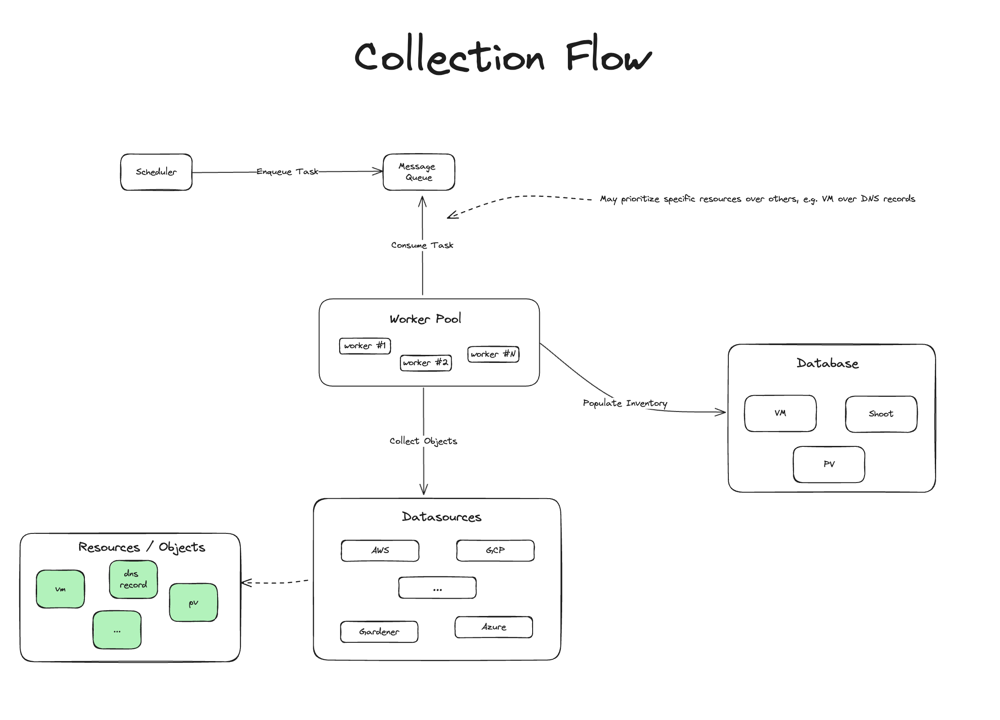

# Design

The Inventory system is based on the following design goals.

## Data Model

The data model used by the Inventory system looks like this:

Each entity within the system (e.g., Virtual Machine, AWS VPC) is
represented by separate table in the database, where connection between
different entities is done via a link table.

## Data Collection

The following diagram illustrates the high-level overview of how data collection
works:

The data collection flow provides the following benefits:

* A message queue is used for submitting messages, which represent tasks to be
  run by workers.
* Messages may be submitted on regular basis (e.g., via a scheduler), or ad-hoc via
  clients of the system.
* Collection of resources is done independently from each other and concurrently.
* Resource collection may be prioritized.

Since collection happens concurrently and independently from each other, linking
resources is also represented as a separate, independent task.

Another key point to mention here is that this is not a real-time system.

## HA

The system should be highly available, where no single point of failure
component should exist.

This requirement would enable rolling upgrades of the various components of the
system, without causing service disruption.

Tasks which fail (e.g., remote endpoints are not reachable), should be retried
and eventually successfully processed by the workers.

## Scalable

The system should be able to scale horizontally in situations where we have many
data sources and many messages to process.

The tasks processed by workers are mainly I/O related, and not CPU intensive.

Being able to scale the workers is important in order to keep up with the amount
of data we need to collect, so that we don't fall too much behind.

## Durability & Persistence

Messages should be durable and persistent, which means they should survive
throughout the process lifecycle.

This makes it possible for workers to continue where they left off, and also to
inspect task results on a later stage.

## Introspection

The system will provide means for introspection such as:

* Monitoring the number of active/pending/scheduled tasks
* Be able to cancel or delete long-running tasks
* Expose telemetry for the various components

## Prioritization

Certain objects in the system may have a higher priority than others.

Being able to prioritize the collection of certain objects over others allows us
to identify potentially leaked resources sooner, rather than later.

## API

The system shall expose collected data over a REST API.
