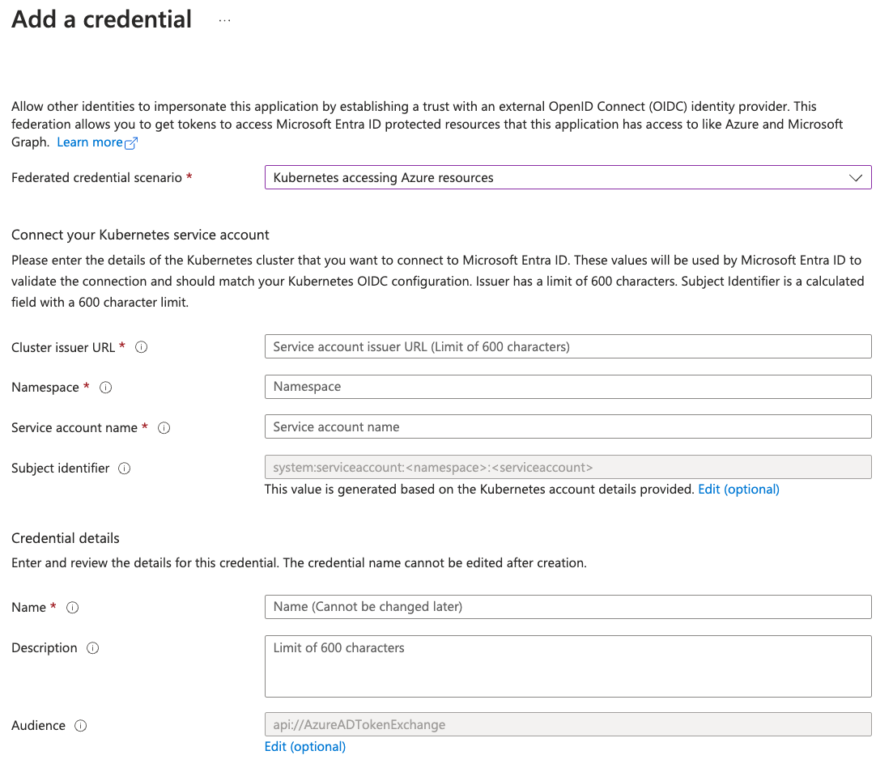

# OpenID Connect Trust between Azure and Inventory

This document describes how to establish [OpenID Connect](http://openid.net/connect/) Trust between Azure and Inventory running
in a Kubernetes cluster.

Having OIDC Trust between Azure and Inventory means that you don't have to worry
about maintaining and rotating long-lived, static credentials when collecting
resources from Azure.

Instead, Inventory will use short-lived [JWT](https://jwt.io/) tokens, which are
signed by the Kubernetes API server (the IdP trusted by Azure), which will then
be exchanged for Azure access tokens.

In this document we will be establishing OIDC Trust between Azure and Kubernetes
cluster running outside of Azure. In this setup we will [register a new Azure App](https://learn.microsoft.com/en-us/entra/identity-platform/quickstart-register-app),
then [configure the app to trust an external identity
provider](https://learn.microsoft.com/en-us/entra/workload-id/workload-identity-federation-create-trust)
by creating `Federated credentials` for our Kubernetes cluster, where Inventory
is running.

For additional information on the topic, please refer to the [Workload Identity Federation](https://learn.microsoft.com/en-us/entra/workload-id/workload-identity-federation)
documentation.

## Requirements

You need a Kubernetes cluster with the
[ServiceAccountIssuerDiscovery](https://kubernetes.io/docs/tasks/configure-pod-container/configure-service-account/#service-account-issuer-discovery)
flag enabled.

The Inventory system will be deployed in the Kubernetes cluster. Check the
[deployment/kustomize](../deployment/kustomize) directory for sample
[kustomize](https://kustomize.io/) manifests, which you can use to deploy the
Inventory.

In order to find out the OpenID Connect Provider URL for your Kubernetes
cluster, run the following command:

```sh
kubectl get --raw /.well-known/openid-configuration
```

Sample response:

``` javascript
{
  "issuer": "https://foobar.example.org",
  "jwks_uri": "https://foobar.example.org/openid/v1/jwks",
  "response_types_supported": [
    "id_token"
  ],
  "subject_types_supported": [
    "public"
  ],
  "id_token_signing_alg_values_supported": [
    "RS256"
  ]
}
```

Since our Kubernetes cluster will be running outside of Azure, we need to
[register a new Azure App](https://learn.microsoft.com/en-us/entra/identity-platform/quickstart-register-app).

After that, we need to [configure the app to trust an external identity provider](https://learn.microsoft.com/en-us/entra/workload-id/workload-identity-federation-create-trust):

1. Navigate to your app, then on the left-hand side click on
`Certficates & secrets`, and then select the `Federated credentials` tab.

1. Click on `Add credential` button.

1. Select `Kubernetes accessing Azure resources` for the `Federated credential scenario`,
and then fill in the `Cluster issuer URL`, `Namespace`, `Service account name`, etc.

    

    Once we have the `Federated client` created for our Kubernetes cluster, we need to configure IAM permissions for our Azure App.

1. Navigate to `Subscriptions` and select the `Subscription` to which we want to
give our App access to.

1. Click on the `Add > Add role assignment` button.

1. Select the `Reader` role and add the App as a member.

## Configuration

The Azure specific configuration used by the Inventory system resides in the `azure`
section of the [configuration file](../examples/config.yaml).

The Azure API clients used by the Inventory workers may be initialized either by
using the [DefaultAzureCredential chain of credential providers](https://learn.microsoft.com/en-us/azure/developer/go/sdk/authentication-overview#use-defaultazurecredential-in-an-application),
or by using OIDC trust via [Workload Identity Federation](https://learn.microsoft.com/en-us/entra/workload-id/workload-identity-federation)

The `azure.credentials` config section provides the _named_ credentials, which
will be used when accessing the various Azure services (e.g., Compute, Resource Manager).

The `azure.services` config section provides service-specific configuration,
e.g., we can configure which named credentials to be used when accessing the
Azure API services from Inventory.

The following example configures two _named_ credentials - `foo` and `bar`, and
associates them with the Azure Compute service. This means that when collecting
Compute resources, Inventory will connect to Azure using both credentials and
collect from them.

``` yaml
# Azure specific configuration
azure:
  # Setting `is_enabled' to false would not create any Azure clients, and as a
  # result Inventory will not process any of the Azure collection tasks.
  is_enabled: true

  # This section provides configuration specific to each Azure service and which
  # named credentials to be used when creating API clients for the respective
  # service. Inventory supports specifying multiple named credentials per
  # service, which means that collection will happen against each configured
  # named credential.
  #
  # For instance, if `compute' service specifies named credentials `foo' and
  # `bar', then Inventory will connect and collect Compute resources from the
  # Subscriptions and Resource Groups, for which `foo' and `bar' credentials
  # have access to.
  services:
    compute:
      use_credentials:
        - foo
        - bar

  # The `credentials' section provides named credentials, which are used by the
  # various Azure services. The currently supported authentication mechanisms
  # are `default' and `workload_identity'.
  #
  # When using `default' as the authentication mechanism the API clients will be
  # initialized using the `DefaultAzureCredential' chain of credential providers [1].
  #
  # When using `workload_identity' the API clients will be configured to
  # authenticate using Workload Identity Federation [2]. For more details,
  # please refer to the docs/oidc-azure.md document.
  #
  # [1]: https://learn.microsoft.com/en-us/azure/developer/go/sdk/authentication-overview
  # [2]: https://learn.microsoft.com/en-us/entra/workload-id/workload-identity-federation
  credentials:
    foo:
      # Set to `default' for `DefaultAzureCredential` chain of providers
      authentication: default

    bar:
      # With `workload_identity' authentication the API client will be
      # configured to authenticate using Workload Identity Federation.
      authentication: workload_identity
      workload_identity:
        client_id: my-registered-app-uuid
        tenant_id: my-tenant-uuid
        token_file: /path/to/my-jwt-token.txt
```

The currently supported authentication mechanisms that a _named_ credential may
use are:

- `default`
- `workload_identity`

With `default` authentication mechanism, the Azure API clients will be initialized
using [DefaultAzureCredential chain of credential providers](https://learn.microsoft.com/en-us/azure/developer/go/sdk/authentication-overview#use-defaultazurecredential-in-an-application).

When using `workload_identity` authentication mechanism, the Azure API clients
will use OIDC Trust via [Workload Identity Federation](https://learn.microsoft.com/en-us/entra/workload-id/workload-identity-federation).

With `workload_identity` you can configure the path to the token file to use
[service account token projection](https://kubernetes.io/docs/tasks/configure-pod-container/configure-service-account/#launch-a-pod-using-service-account-token-projection),
so that your Kubernetes tokens are automatically refreshed and ready to use by Inventory.

## References

Please refer to the following links for additional information on the topic:

- [What is OpenID Connect](https://openid.net/developers/how-connect-works/)
- [OpenID Connect Core 1.0 spec](https://openid.net/specs/openid-connect-core-1_0.html)
- [Workload Identity Federation](https://learn.microsoft.com/en-us/entra/workload-id/workload-identity-federation)
- [Register a new Azure App](https://learn.microsoft.com/en-us/entra/identity-platform/quickstart-register-app),
- [Configure an app to trust an external identity provider](https://learn.microsoft.com/en-us/entra/workload-id/workload-identity-federation-create-trust)
- [Authenticate Go apps to Azure services by using the Azure SDK for Go](https://learn.microsoft.com/en-us/azure/developer/go/sdk/authentication-overview)
- [Kubernetes Service Account Token Projection](https://kubernetes.io/docs/tasks/configure-pod-container/configure-service-account/#launch-a-pod-using-service-account-token-projection)
